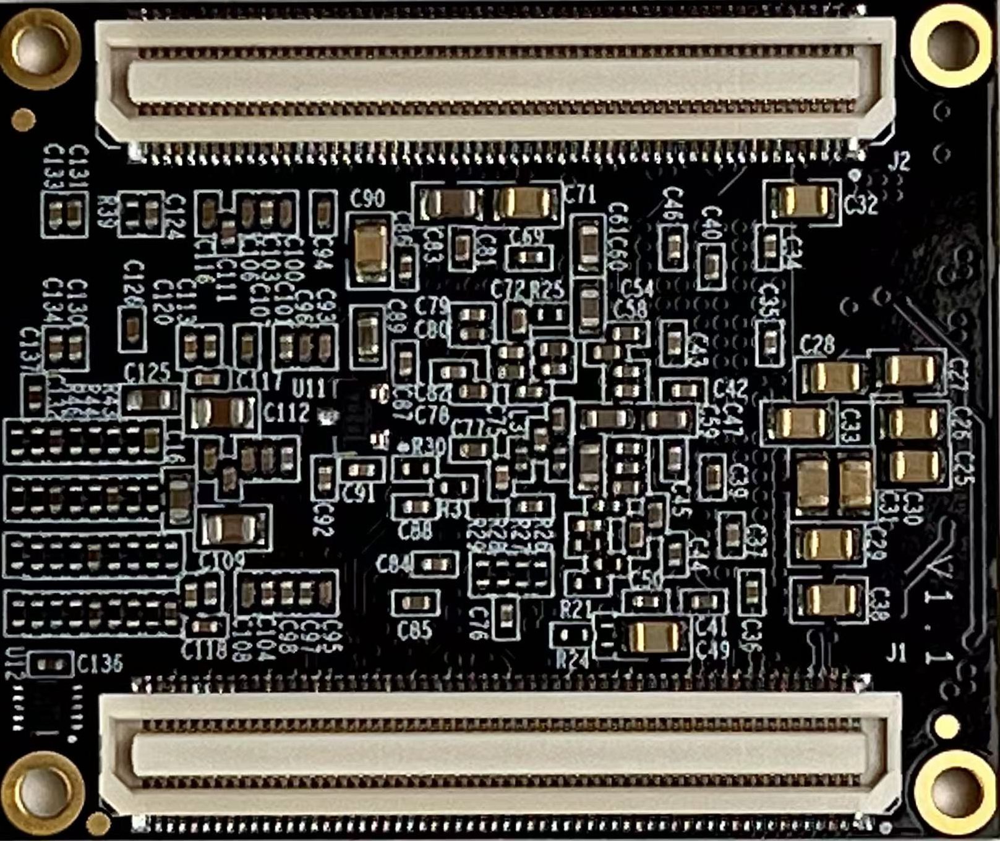
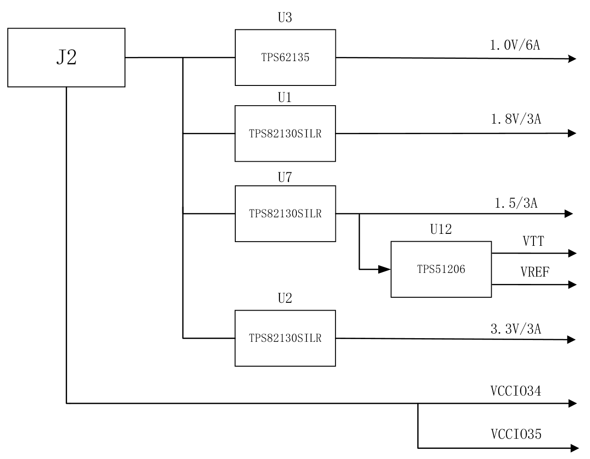

## 

## PB7Z020C SOM Overview

Pipeblue Electronics Limited’s PB7Z020C SOM, built on AMD’s Zynq‑7000 development platform, features the XC7Z020‑2CLG400I device from the Zynq family. This device combines a dual‑core ARM Cortex™‑A9 Processing System (PS) with FPGA Programmable Logic (PL), fully exploiting the advantages of heterogeneous computing.

The Zynq PS integrates two ARM Cortex™‑A9 processor cores and, via the AMBA® interconnect architecture, interfaces with external memory and peripherals to deliver high‑efficiency data throughput. In addition, the device includes multiple on‑chip memory blocks, external memory interfaces, and a rich set of peripheral I/O to accommodate a wide range of application requirements.

The SOM is equipped with two Micron MT41K256M16TW‑107 DDR3 SDRAM devices, each offering 512 MB of capacity. Both DRAM chips are connected to the Zynq via a 32‑bit data bus, and the PS–DDR3 read/write clock runs at 533 MHz, delivering high‑speed data access. This memory configuration guarantees smooth execution of high‑bandwidth data processing tasks—especially well suited for large‑scale data streaming and real‑time computation.

To enable connectivity with external peripherals, the SOM exposes multiple interfaces on the PS side, including:

- USB 2.0
- Gigabit Ethernet (1000 Base‑T)
- SD‑Card interface (SDIO)
- Additional MIO (Multiplexed I/O) pins

On the PL side, nearly all 122 I/O pins from BANK13, BANK34, and BANK35 are routed to expansion headers. These I/O banks support standard logic‑level signaling out of the box, and can be reconfigured to other voltage levels by swapping the on‑board LDO regulators.

This abundant I/O provisioning makes the PB7Z020C SOM ideal for applications requiring high‑speed data transfer and a large number of external interfaces, facilitating rapid secondary development and prototyping.

It’s worth noting that all signal traces between the Zynq device and its interfaces are strictly length‑matched and differentially routed to guarantee optimal signal integrity and high‑quality data transmission. Despite its ultra‑compact footprint of just 35 mm × 42 mm, the SOM still delivers a wealth of functionality and expansion headers—making it the perfect choice for rapid secondary development and space‑constrained designs.

In summary, this Zynq‑7000‑based SOM delivers exceptional compute performance, high‑speed data throughput, and extensive I/O expandability, making it ideally suited for a wide range of embedded systems, industrial automation, communications, and image‑processing applications. Whether viewed from a hardware design or software development perspective, it meets the stringent performance and flexibility demands of professional users.

Figure 1：Front View of the PB7Z020C SOM

Figure 2：Back View of the PB7Z020C SOM

## AMD ZYNQ

The development board is built around the AMD Zynq‑7000 series XC7Z020‑2CLG400I device, serving as its central processing unit. The Processing System (PS) within the Zynq‑7000 integrates two high‑performance ARM Cortex™‑A9 processor cores, offering robust computational capabilities. It leverages the AMBA® interconnect architecture to ensure seamless and efficient data transfers and communication between components.

This architecture supports not only on‑chip memory but also a variety of external memory interfaces, including DDR3 and QSPI Flash, providing flexible configuration and expansion options to meet the demands of complex embedded systems.

The Processing System (PS) of the Zynq‑7000 chip also integrates a wide range of peripheral interfaces, supporting USB, Gigabit Ethernet, SD/SDIO, I²C, CAN, UART, GPIO, and other commonly used I/O protocols. These interfaces enable seamless connection and data exchange with various external devices.

- **USB** interface supports high-speed data transfer, ideal for connecting external storage devices, debugging tools, and more.
- **Gigabit Ethernet** provides fast and reliable network connectivity, making it well-suited for communication-intensive applications.
- **SD/SDIO** enables data interaction with SD cards and other peripherals, offering flexible storage options.
- **I²C and CAN** bus interfaces support communication with a wide variety of sensors, actuators, and industrial devices, facilitating industrial control and IoT applications.

In addition, the Processing System (PS) of the Zynq‑7000 device is capable of independently booting upon power-up or system reset, offering highly flexible boot options. It supports booting from various sources, including on-chip memory, external flash (such as QSPI), SD cards, or other external devices. This flexibility ensures fast system initialization and stable runtime operation, making it ideal for applications with strict startup and reliability requirements.

The tight integration between the Zynq‑7000 Processing System (PS) and its Programmable Logic (PL) offers a highly integrated, high‑performance solution. The PL section provides abundant programmable logic resources, including DSP slices, block RAM, and high‑speed I/O interfaces. These resources enable hardware‑level acceleration for compute‑intensive and data‑driven tasks. By working in tandem with the PS, the PL significantly enhances the overall system performance and responsiveness.

A high-level block diagram of the Zynq‑7000 architecture is shown below. It illustrates the interconnection between the PS and PL, along with peripheral interface options, helping users understand the chip architecture and how to best leverage its capabilities in their designs.

Figure 3：Block Diagram of the Zynq‑7000 SoC

Processing System (PS) Specifications:

- Dual-core ARM Cortex‑A9 processors based on the ARMv7 architecture, with clock speeds up to 1 GHz
- 32 KB L1 cache per core and 512 KB shared L2 cache
- Integrated Boot ROM and 256 KB on-chip RAM
- Supports 16-/32-bit DDR2 and DDR3 memory interfaces
- Dual Gigabit Ethernet controllers with support for scatter-gather DMA, GMII, RGMII, and SGMII
- Two USB 2.0 OTG (On-The-Go) interfaces, each supporting up to 12 endpoints
- Two CAN 2.0B controllers
- Two SD/SDIO/MMC controllers
- 2× SPI, 2× UART, and 2× I²C interfaces
- 4 banks of 32-bit GPIOs, with 54 PS MIOs and 64 EMIOs connectable to the PL
- High-bandwidth interconnect between PS internal buses and PS–PL interfaces

Programmable Logic (PL) Specifications:

- Logic Cells: 85,000
- Look-Up Tables (LUTs): 53,200
- Flip-Flops: 106,400
- 18×25 Multipliers (DSP MACCs): 220
- Block RAM: 4.9 Mb total
- Dual on-chip ADCs, supporting:
  - Internal voltage and temperature monitoring
  - Up to 17 external differential input channels
  - Sampling rate up to 1 MSPS (mega-samples per second)

The XC7Z020‑2CLG400I chip features a speed grade of –2, is rated for industrial temperature ranges, and comes in a 400-ball BGA package with a 0.8 mm ball pitch. The part numbering of the Zynq‑7000 series follows the format shown in the figure below.

Figure 4：Zynq‑7000 Series SoC Part Number Nomenclature

The image below shows the actual XC7Z020 chip used on the development board.

Figure 5：Physical View of the XC7Z020 SoC Device

## Clock Configuration

The PB7Z020C SOM provides a dedicated onboard clock to the Zynq‑7000 Processing System (PS), allowing the PS to run and boot autonomously. This clock signal guarantees stable PS operation without the need for any external clock source, meeting the requirements for independent processing. By supplying its own clock, the PS can perform efficient data handling and task scheduling without relying on the Programmable Logic (PL) clock, thereby enhancing overall system flexibility and reliability.

On the other hand, the PL clock is supplied by the carrier board, meaning that the PL clock domain is driven by external hardware circuitry to ensure proper timing and synchronization within the Programmable Logic. This segregated clock scheme allows the PS and PL domains to be managed independently, thereby optimizing overall system timing control and resource utilization.

This clocking scheme effectively delivers tailored clock sources to both the PS and PL domains, ensuring coordinated and stable operation across all system modules.

### PS System Clock Source

The PS clock input for the Zynq device is provided by the X1 crystal oscillator on the SOM, which operates at a frequency of 33.333333 MHz. After buffering, this clock signal is routed to the PS_CLK_500 pin in the BANK 500 region of the Zynq device, supplying a stable clock source to the ARM Cortex™-A9 Processing System. This precise clock input ensures accurate internal PLL multiplication and peripheral timing at the PS system’s 1 GHz main frequency, minimizing performance degradation caused by clock jitter or deviation.

In the PCB layout, the routing of the X1 crystal oscillator undergoes meticulous impedance matching and loop minimization to reduce phase noise and electromagnetic interference affecting the clock signal. Additionally, the strategic placement of bypass capacitors and RF suppression components in the oscillator’s power supply further enhances the clock signal’s purity and noise immunity.

The diagram below illustrates the schematic connection from the X1 crystal oscillator to the PS_CLK_500 pin of the Zynq device:

Figure 6：Active Crystal Oscillator Schematic on the PS Side

The image below shows the physical view of the active crystal oscillator on the PS side:

Figure 7：Physical Image of the 33.333333 MHz Active Crystal Oscillator

Clock Pin Assignment:

| Signal Name                      | Zynq Pin                          |
|-----|----------|
| PS_CLK_500                    | E7                                |

Table 1：PS Clock Pin Configuration

## Power Supply

The PB7Z020C SOM is powered by a DC 5V supply provided through the carrier board. Additionally, the power for BANK34 and BANK35 is also supplied via the carrier board. The power design schematic of the board is shown in the figure below:

Figure 8：Power Connector Wiring in the Schematic

The development board uses an external +5 V input, which is converted into four separate power rails—+1.0 V, +1.8 V, +1.5 V, and +3.3 V—through four high-efficiency DC/DC converter modules. These provide the core and I/O voltages as follows:

- The +1.0 V rail primarily supplies the core voltage for both the PS and PL, with a maximum output current of 6 A, meeting the power demands of the FPGA core and processing system during high-frequency operation.
- The +1.8 V and +1.5 V rails serve as I/O and memory voltages respectively, each rated for 3 A output current. They provide power to the PS I/O, Bank 13, and DDR3 VDD and VREF/VTT pins.
- The +3.3 V rail powers peripherals and PMOD interfaces, with a maximum output current of 500 mA, capable of directly driving most external devices.

Four 3.3 V power lines are routed out from the J2 connector by default as the I/O voltage for BANK 34 and BANK 35. Users can adjust the I/O voltage levels for these two banks by changing the VCCIO34 and VCCIO35 jumper settings on the carrier board.

Additionally, the DDR3 VTT and VREF voltages are generated by the TI TPS51206 IC based on the +1.5 V rail, ensuring that the memory interface’s termination and reference voltages comply with JEDEC standards.

The functions of each power rail are summarized in the table below:

| Power Supply             | Function                                      |
|-----|----------|
| +1.0V                | Core Voltages for Zynq PS and PL Domains                     |
| +1.8V                | Auxiliary Voltages for Zynq PS and PL Domains, BANK 501 I/O Voltage       |
| +3.3V                | VCCIO for Zynq Bank0, Bank500, and Bank13; QSPI Flash; Clock Crystal Oscillator       |
| +1.5V                | DDR3, ZYNQ Bank501                            |
| VREF, VTT（+0.75V）  | DDR3                                          |
| VCCIO34/35           | Bank34, Bank35                                |

Table 2：Power Distribution Functions

The Zynq SoC imposes strict power-up sequencing requirements for its various power rails. To ensure stable internal voltage domains and prevent damage to logic and memory modules, the SOM’s power circuit is designed with the following sequence:

- +1.0 V core voltage (PS/PL core domains)
- +1.8 V I/O voltage (PS I/O and Bank 13)
- +1.5 V memory voltage (DDR3 VDD) and VTT/VREF
- +3.3 V peripheral and I/O voltage (including default I/O for Bank 34/35 on J2)

During power-up, the +1.0 V and +1.8 V rails must first stabilize at their nominal voltages before the +1.5 V (including DDR3 termination and reference voltages) and +3.3 V rails are powered simultaneously. This sequencing avoids issues such as PLL lock loss or undefined states in internal SRAM and I/O lines caused by missing or unstable power.

Since the I/O voltages for Bank 34 and Bank 35 are supplied by the carrier board, their power-up timing should lag behind the main +5 V input. This ensures that the SOM’s DC/DC converters stabilize before these optional I/O voltages are applied. When designing a custom carrier board supplying VCCIO34 and VCCIO35, users should ensure these voltages power up slightly after the main power rails and align their timing control strictly with the +1.0 V, +1.8 V, +1.5 V, and +3.3 V rails on the SOM to guarantee a safe and reliable startup of the entire Zynq system.

## Block Diagram

Figure 9：Front Panel Layout Diagram（Top View）

## DDR3 DRAM

The PB7Z020C SOM is equipped with two Micron DDR3 SDRAM chips (total capacity of 1 GB), model MT41K256M16TW-107, which are compatible with Hynix H5TQ4G63AFR-PBI. Each DDR3 chip has a capacity of 512 MB and a 32-bit data bus width, delivering high-bandwidth data transfer capabilities. The DDR3 SDRAM supports a maximum operating frequency of 533 MHz, corresponding to a data rate of 1066 Mbps, meeting the memory bandwidth demands of high-performance systems.

These DDR3 SDRAM chips are directly connected to the Zynq Processing System (PS) via the BANK 502 memory interface, providing fast and efficient memory access to ensure smooth and stable operation when handling large-scale data. Through tight integration with the Zynq device, this DDR3 memory subsystem offers a reliable solution suitable for embedded applications requiring high data throughput and intensive computation.

The table below details the specific configuration parameters of the DDR3 SDRAM:

| Reference Designator | Chip Model | Capacity | Manufacturer |
|-------|----------|-------|----------|
| U8,U9 | MT41K256M16TW-107 | 256M x 16bit | Micron |

Table 3：DDR3 SDRAM Specifications

The hardware design of the DDR3 memory strictly considers signal integrity to ensure system stability and high performance. During the circuit and PCB design phases, careful selection of matching resistors and termination resistors was made to minimize signal reflections and interference, thereby guaranteeing signal transmission quality. Additionally, impedance control and length matching of the DDR3 data traces were implemented to maintain consistent impedance, reducing signal attenuation and timing issues, which enhances memory stability and data transmission reliability.

These design details ensure that the DDR3 SDRAM operates reliably at high frequencies, preventing common issues such as signal distortion and clock jitter. This is especially critical during high-speed data transfers, significantly lowering the risk of potential system failures. Through rigorous design standards and manufacturing processes, the system supports high-frequency, high-speed operation of DDR3 DRAM, ensuring the reliability and efficient performance of large-capacity memory.

The hardware connection diagram of the DDR3 DRAM is shown below:

Figure 10：DDR3 DRAM Hardware Connections

The image below shows the physical view of the DDR3 DRAM.

Figure 11：Physical Image of the DDR3 DRAM Chip

DDR3 DRAM Pin Assignment:

| Signal Name               | ZYNQ Pin Name          | ZYNQ Pin Number             |
|-----------------------|---------------------|------------------------|
| DDR3_DQS0_P       | PS_DDR_DQS_P0_502   | C2                     |
| DDR3_DQS0_N       | PS_DDR_DQS_N0_502   | B2                     |
| DDR3_DQS1_P       | PS_DDR_DQS_P1_502   | G2                     |
| DDR3_DQS1_N       | PS_DDR_DQS_N1_502   | F2                     |
| DDR3_DQS2_P       | PS_DDR_DQS_P2_502   | R2                     |
| DDR3_DQS2_N       | PS_DDR_DQS_N2_502   | T2                     |
| DDR3_DQS3_P       | PS_DDR_DQS_P3_502   | W5                     |
| DDR3_DQS4_N       | PS_DDR_DQS_N3_502   | W4                     |
| DDR3_D0           | PS_DDR_DQ0_502      | C3                     |
| DDR3_D1           | PS_DDR_DQ1_502      | B3                     |
| DDR3_D2           | PS_DDR_DQ2_502      | A2                     |
| DDR3_D3           | PS_DDR_DQ3_502      | A4                     |
| DDR3_D4           | PS_DDR_DQ4_502      | D3                     |
| DDR3_D5           | PS_DDR_DQ5_502      | D1                     |
| DDR3_D6           | PS_DDR_DQ6_502      | C1                     |
| DDR3_D7           | PS_DDR_DQ7_502      | E1                     |
| DDR3_D8           | PS_DDR_DQ8_502      | E2                     |
| DDR3_D9           | PS_DDR_DQ9_502      | E3                     |
| DDR3_D10          | PS_DDR_DQ10_502     | G3                     |
| DDR3_D11          | PS_DDR_DQ11_502     | H3                     |
| DDR3_D12          | PS_DDR_DQ12_502     | J3                     |
| DDR3_D13          | PS_DDR_DQ13_502     | H2                     |
| DDR3_D14          | PS_DDR_DQ14_502     | H1                     |
| DDR3_D15          | PS_DDR_DQ15_502     | J1                     |
| DDR3_D16          | PS_DDR_DQ16_502     | P1                     |
| DDR3_D17          | PS_DDR_DQ17_502     | P3                     |
| DDR3_D18          | PS_DDR_DQ18_502     | R3                     |
| DDR3_D19          | PS_DDR_DQ19_502     | R1                     |
| DDR3_D20          | PS_DDR_DQ20_502     | T4                     |
| DDR3_D21          | PS_DDR_DQ21_502     | U4                     |
| DDR3_D22          | PS_DDR_DQ22_502     | U2                     |
| DDR3_D23          | PS_DDR_DQ23_502     | U3                     |
| DDR3_D24          | PS_DDR_DQ24_502     | V1                     |
| DDR3_D25          | PS_DDR_DQ25_502     | Y3                     |
| DDR3_D26          | PS_DDR_DQ26_502     | W1                     |
| DDR3_D27          | PS_DDR_DQ27_502     | Y4                     |
| DDR3_D28          | PS_DDR_DQ28_502     | Y2                     |
| DDR3_D29          | PS_DDR_DQ29_502     | W3                     |
| DDR3_D30          | PS_DDR_DQ30_502     | V2                     |
| DDR3_D31          | PS_DDR_DQ31_502     | V3                     |
| DDR3_DM0          | PS_DDR_DM0_502      | A1                     |
| DDR3_DM1          | PS_DDR_DM1_502      | F1                     |
| DDR3_DM2          | PS_DDR_DM2_502      | T1                     |
| DDR3_DM3          | PS_DDR_DM3_502      | Y1                     |
| DDR3_A0           | PS_DDR_A0_502       | N2                     |
| DDR3_A1           | PS_DDR_A1_502       | K2                     |
| DDR3_A2           | PS_DDR_A2_502       | M3                     |
| DDR3_A3           | PS_DDR_A3_502       | K3                     |
| DDR3_A4           | PS_DDR_A4_502       | M4                     |
| DDR3_A5           | PS_DDR_A5_502       | L1                     |
| DDR3_A6           | PS_DDR_A6_502       | L4                     |
| DDR3_A7           | PS_DDR_A7_502       | K4                     |
| DDR3_A8           | PS_DDR_A8_502       | K1                     |
| DDR3_A9           | PS_DDR_A9_502       | J4                     |
| DDR3_A10          | PS_DDR_A10_502      | F5                     |
| DDR3_A11          | PS_DDR_A11_502      | G4                     |
| DDR3_A12          | PS_DDR_A12_502      | E4                     |
| DDR3_A13          | PS_DDR_A13_502      | D4                     |
| DDR3_A14          | PS_DDR_A14_502      | F4                     |
| DDR3_BA0          | PS_DDR_BA0_502      | L5                     |
| DDR3_BA1          | PS_DDR_BA1_502      | R4                     |
| DDR3_BA2          | PS_DDR_BA2_502      | J5                     |
| DDR3_S0           | PS_DDR_CS_B_502     | N1                     |
| DDR3_RAS          | PS_DDR_RAS_B_502    | P4                     |
| DDR3_CAS          | PS_DDR_CAS_B_502    | P5                     |
| DDR3_WE           | PS_DDR_WE_B_502     | M5                     |
| DDR3_ODT          | PS_DDR_ODT_502      | N5                     |
| DDR3_RESET        | PS_DDR_DRST_B_502   | B4                     |
| DDR3_CLK0_P       | PS_DDR_CKP_502      | L2                     |
| DDR3_CLK0_N       | PS_DDR_CKN_502      | M2                     |
| DDR3_CKE          | PS_DDR_CKE_502      | N3                     |

Table 4：DDR3 DRAM Pin Assignment

## QSPI Flash

The SOM is equipped with a 256 Mbit Quad-SPI Flash chip, model W25Q256FVEI, operating at a 3.3 V CMOS voltage level. This chip offers a large storage capacity, providing an efficient non-volatile memory solution for the system. Due to its non-volatile nature, the QSPI Flash is suitable not only for storing user data but also as a system boot device, housing the boot image. The boot image typically includes the FPGA configuration file (bitstream), ARM processor application code, and other user data files.

In embedded systems, the QSPI Flash’s high-speed read/write capabilities and ample storage make it an ideal boot storage medium. It supports fast data access through the Quad-SPI protocol, significantly improving system boot times and offering reliable storage for subsequent data loading.

Additionally, the W25Q256FVEI chip features low power consumption and excellent noise immunity, making it well-suited for applications requiring high stability and data integrity. Its support for a 4-bit parallel data transfer mode provides increased data bandwidth to meet high-speed data access demands.

The specific model and key parameters of this chip are detailed in the table below:

| Reference Designator | Chip Model | Capacity | Manufacturer |
|-----|----------|-------|----------|
| U15 | W25Q256FVEI | 32M Byte | Winbond |

Table 5：QSPI FLASH Specifications

The QSPI Flash chip is connected to the Zynq device’s Processing System (PS) via the GPIO interface on BANK 500. To enable proper communication between the system and the QSPI Flash, the GPIO pins on the PS side must be configured to function as the QSPI Flash interface. This configuration allows the Zynq Processing System to efficiently exchange data with the Flash memory using the Quad-SPI protocol, achieving high-speed read and write operations.

In hardware design, the GPIO functionality must be mapped accurately to the corresponding pins of the QSPI Flash to ensure stable and efficient data transfer. Additionally, considerations for signal integrity, timing requirements, and power management are essential to maintain the QSPI Flash’s stability during high-frequency operation. Through careful PCB layout and precise signal control, the QSPI interface can deliver its optimal performance.

The diagram below illustrates part of the QSPI Flash connections in the schematic:

Figure 12：QSPI Flash Schematic Connection

The image below shows the physical appearance of the QSPI Flash chip.

Figure 13：Physical Image of the QSPI Flash Chip

Pin Assignment Configuration:

| Signal Name               | ZYNQ Pin Name          | ZYNQ Pin Number             |
|-----|----------|-------|
| QSPI_SCK                | PS_MIO6_500      | A5                  |
| QSPI_CS                 | PS_MIO1_500      | A7                  |
| QSPI_D0                 | PS_MIO2_500      | B8                  |
| QSPI_D1                 | PS_MIO3_500      | D6                  |
| QSPI_D2                 | PS_MIO4_500      | B7                  |
| QSPI_D3                 | PS_MIO5_500      | A6                  |

Table 6：QSPI Flash Pin Assignment

## Connector Pin Definition

The SOM provides two high-speed expansion interfaces via two 120-pin board-to-board connectors (J2 and J1) for robust connection to the carrier board. These connectors feature a fine 0.5 mm pitch, ensuring both large-scale I/O expansion and high-density signal routing. The detailed functional allocation is as follows:

**J2 Connector (Power and Selected I/O Pins)**

- +5 V Main Power Input
- VCCIO (Configurable I/O Voltage Level)
- PS System I/O Signals (Including GPIO, UART, SPI, etc.)
- JTAG Debug Interface (TCK, TMS, TDI, TDO, TRST, etc.)

**J1 Connector (Remaining I/O and MIO Pins)**

- Remaining PS System MIO Signals (USB, Ethernet, SDIO, and Other High-Speed Interfaces)
- PL Programmable Logic BANK34/35 I/O Signals (Including Differential Pairs and Single-Ended Lines)

To meet high-speed signal integrity requirements, the differential pairs on connectors J2 and J1 (such as high-speed LVDS or GTIO signals) have undergone strict impedance control and length-matched routing. The pin arrangement of the board-to-board connectors has also been optimized, employing an interleaved power and ground line layout to further reduce crosstalk and power supply noise.

**Voltage Level Configuration**

The I/O voltage levels for BANK34 and BANK35 are determined by the VCCIO input on the connectors. Users can configure VCCIO34 and VCCIO35 on the carrier board to 1.8 V, 2.5 V, or 3.3 V (not exceeding 3.3 V) to accommodate different external device interfaces. Our standard PB7Z020 carrier board ships with VCCIO34 and VCCIO35 preset to 3.3 V by default, allowing immediate use without any additional modifications.

### Pin Assignment of the J1 Connector

| J1 Pin | Signal Name  | Pin Number   | J1 Pin  | Signal Name  | Pin Number   |
|-----|----------|-------|-----|----------|-------|
| 1      | IO35_L1P        | C20    | 2      | IO35_L15N       | F20     |
| 3      | IO35_L1N        | B20    | 4      | IO35_L15P       | F19     |
| 5      | IO35_L18N       | G20    | 6      | IO35_L5P        | E18     |
| 7      | IO35_L18P       | G19    | 8      | IO35_L5N        | E19     |
| 9      | GND             | T13    | 10     | GND             | T13     |
| 11     | IO35_L10N       | J19    | 12     | IO35_L3N        | D18     |
| 13     | IO35_L10P       | K19    | 14     | IO35_L3P        | E17     |
| 15     | IO35_L2N        | A20    | 16     | IO35_L4P        | D19     |
| 17     | IO35_L2P        | B19    | 18     | IO35_L4N        | D20     |
| 19     | GND             | T13    | 20     | GND             | T13     |
| 21     | IO35_L8P        | M17    | 22     | IO35_L9N        | L20     |
| 23     | IO35_L8N        | M18    | 24     | IO35_L9P        | L19     |
| 25     | IO35_L7P        | M19    | 26     | IO35_L6P        | F16     |
| 27     | IO35_L7N        | M20    | 28     | IO35_L6N        | F17     |
| 29     | GND             | T13    | 30     | GND             | T13     |
| 31     | IO35_L17N       | H20    | 32     | IO35_L16N       | G18     |
| 33     | IO35_L17P       | J20    | 34     | IO35_L16P       | G17     |
| 35     | IO35_L19N       | G15    | 36     | IO35_L13N       | H17     |
| 37     | IO35_L19P       | H15    | 38     | IO35_L13P       | H16     |
| 39     | GND             | T13    | 40     | GND             | T13     |
| 41     | IO35_L12N       | K18    | 42     | IO35_L14N       | H18     |
| 43     | IO35_L12P       | K17    | 44     | IO35_L14P       | J18     |
| 45     | IO35_L24N       | J16    | 46     | IO35_L20P       | K14     |
| 47     | IO35_L24P       | K16    | 48     | IO35_L20N       | J14     |
| 49     | GND             | T13    | 50     | GND             | T13     |
| 51     | IO35_L21N       | N16    | 52     | IO35_L11P       | L16     |
| 53     | IO35_L21P       | N15    | 54     | IO35_L11N       | L17     |
| 55     | IO35_L22N       | L15    | 56     | IO35_L23P       | M14     |
| 57     | IO35_L22P       | L14    | 58     | IO35_L23N       | M15     |
| 59     | GND             | T13    | 60     | GND             | T13     |
| 61     | PS_MIO22        | B17    | 62     | PS_MIO50        | B13     |
| 63     | PS_MIO27        | D13    | 64     | PS_MIO45        | B15     |
| 65     | PS_MIO23        | D11    | 66     | PS_MIO46        | D16     |
| 67     | PS_MIO24        | A16    | 68     | PS_MIO41        | C17     |
| 69     | GND             | T13    | 70     | GND             | T13     |
| 71     | PS_MIO25        | F15    | 72     | PS_MIO7         | D8      |
| 73     | PS_MIO26        | A15    | 74     | PS_MIO12        | D9      |
| 75     | PS_MIO21        | F14    | 76     | PS_MIO10        | E9      |
| 77     | PS_MIO16        | A19    | 78     | PS_MIO11        | C6      |
| 79     | GND             | T13    | 80     | GND             | T13     |
| 81     | PS_MIO20        | A17    | 82     | PS_MIO9         | B5      |
| 83     | PS_MIO19        | D10    | 84     | PS_MIO14        | C5      |
| 85     | PS_MIO18        | B18    | 86     | PS_MIO8         | D5      |
| 87     | PS_MIO17        | E14    | 88     | PS_MIO0         | E6      |
| 89     | GND             | T13    | 90     | GND             | T13     |
| 91     | PS_MIO39        | C18    | 92     | PS_MIO13        | E8      |
| 93     | PS_MIO38        | E13    | 94     | PS_MIO47        | B14     |
| 95     | PS_MIO37        | A10    | 96     | PS_MIO48        | B12     |
| 97     | PS_MIO28        | C16    | 98     | PS_MIO49        | C12     |
| 99     | GND             | T13    | 100    | GND             | T13     |
| 101    | PS_MIO35        | F12    | 102    | PS_MIO52        | C10     |
| 103    | PS_MIO34        | A12    | 104    | PS_MIO51        | B9      |
| 105    | PS_MIO33        | D15    | 106    | PS_MIO40        | D14     |
| 107    | PS_MIO32        | A14    | 108    | PS_MIO44        | F13     |
| 109    | GND             | T13    | 110    | GND             | T13     |
| 111    | PS_MIO31        | E16    | 112    | PS_MIO15        | C8      |
| 113    | PS_MIO36        | A11    | 114    | PS_MIO42        | E12     |
| 115    | PS_MIO29        | C13    | 116    | PS_MIO43        | A9      |
| 117    | PS_MIO30        | C15    | 118    | PS_MIO53        | C11     |
| 119    | QSPI_D3_PS_MIO5 | A6     | 120    | QSPI_D2_PS_MIO4 | B7      |

Table 7：Pin Assignment of the J1 Connector

### Pin Assignment of the J2 Connector

| J2 Pin  | Signal Name  | Pin Number   | J2 Pin  | Signal Name  | Pin Number   |
|-----|----------|-------|-----|----------|-------|
| 1        | VCC5V    | -       | 2        | VCC5V       | -       |
| 3        | VCC5V    | -       | 4        | VCC5V       | -       |
| 5        | VCC5V    | -       | 6        | VCC5V       | -       |
| 7        | VCC5V    | -       | 8        | VCC5V       | -       |
| 9        | GND      | -       | 10       | GND         | -       |
| 11       | VCCIO_34 | -       | 12       | VCCIO_35    | -       |
| 13       | VCCIO_34 | -       | 14       | VCCIO_35    | -       |
| 15       | VCCIO_34 | -       | 16       | VCCIO_35    | -       |
| 17       | VCCIO_34 | -       | 18       | VCCIO_35    | -       |
| 19       | GND      | -       | 20       | GND         | -       |
| 21       | IO34_L10P        | V15      | 22       | IO34_L7P    | Y16      |
| 23       | IO34_L10N        | W15      | 24       | IO34_L7N    | Y17      |
| 25       | IO34_L15N        | U20      | 26       | IO34_L17P   | Y18      |
| 27       | IO34_L15P        | T20      | 28       | IO34_L17N   | Y19      |
| 29       | GND      | -       | 30       | GND         | -       |
| 31       | IO34_L9N | U17      | 32       | IO34_L8P    | W14      |
| 33       | IO34_L9P | T16      | 34       | IO34_L8N    | Y14      |
| 35       | IO34_L12N        | U19      | 36       | IO34_L3P    | U13      |
| 37       | IO34_L12P        | U18      | 38       | IO34_L3N    | V13      |
| 39       | GND      | -       | 40       | GND         | -       |
| 41       | IO34_L14N        | P20      | 42       | IO34_L21N   | V18      |
| 43       | IO34_L14P        | N20      | 44       | IO34_L21P   | V17      |
| 45       | IO34_L16N        | W20      | 46       | IO34_L18P   | V16      |
| 47       | IO34_L16P        | V20      | 48       | IO34_L18N   | W16      |
| 49       | GND      | -       | 50       | GND         | -       |
| 51       | IO34_L22N        | W19      | 52       | IO34_L23P   | N17      |
| 53       | IO34_L22P        | W18      | 54       | IO34_L23N   | P18      |
| 55       | IO34_L20N        | R18      | 56       | IO34_L13N   | P19      |
| 57       | IO34_L20P        | T17      | 58       | IO34_L13P   | N18      |
| 59       | GND      | -       | 60       | GND         | -       |
| 61       | IO34_L19N        | R17      | 62       | IO34_L11N   | U15      |
| 63       | IO34_L19P        | R16      | 64       | IO34_L11P   | U14      |
| 65       | IO34_L24P        | P15      | 66       | IO34_L5N    | T15      |
| 67       | IO34_L24N        | P16      | 68       | IO34_L5P    | T14      |
| 69       | GND      | -       | 70       | GND         | -       |
| 71       | IO34_L4P | V12      | 72       | IO34_L2N    | U12      |
| 73       | IO34_L4N | W13      | 74       | IO34_L2P    | T12      |
| 75       | IO34_L1P | T11      | 76       | IO34_L6N    | R14      |
| 77       | IO34_L1N | T10      | 78       | IO34_L6P    | P14      |
| 79       | GND      | -       | 80       | GND         | -       |
| 81       | IO13_L13P        | Y7       | 82       | IO13_L21P   | V11      |
| 83       | IO13_L13N        | Y6       | 84       | IO13_L21N   | V10      |
| 85       | IO13_L11N        | V7       | 86       | IO13_L14N   | Y8       |
| 87       | IO13_L11P        | U7       | 88       | IO13_L14P   | Y9       |
| 89       | GND      | -       | 90       | GND         | -       |
| 91       | IO13_L19N        | U5       | 92       | IO13_L22N   | W6       |
| 93       | IO13_L19P       | T5       | 94       | IO13_L22P   | V6       |
| 95       | IO13_L16P        | W10      | 96       | IO13_L15P   | V8       |
| 97       | IO13_L16N        | W9       | 98       | IO13_L15N   | W8       |
| 99       | GND      | -       | 100      | GND         | -       |
| 101      | IO13_L17P        | U9       | 102      | IO13_L20P   | Y12      |
| 103      | IO13_L17N        | U8       | 104      | IO13_L20N   | Y13      |
| 105      | IO13_L18P        | W11      | 106      | IO13_L12N   | U10      |
| 107      | IO13_L18N        | Y11      | 108      | IO13_L12P   | T9       |
| 109      | GND      | -       | 110      | GND         | -       |
| 111      | FPGA_TCK | F9       | 112      | VP          | K9       |
| 113      | FPGA_TMS | J6       | 114      | VN          | L10      |
| 115      | FPGA_TDO | F6       | 116      | PS_POR_B    | C7       |
| 117      | FPGA_TDI | G6       | 118      | FPGA_DONE   | R11      |
| 119      | NC       | -       | 120      | NC          | -       |

Table 8：Pin Assignment of the J2 Connector

